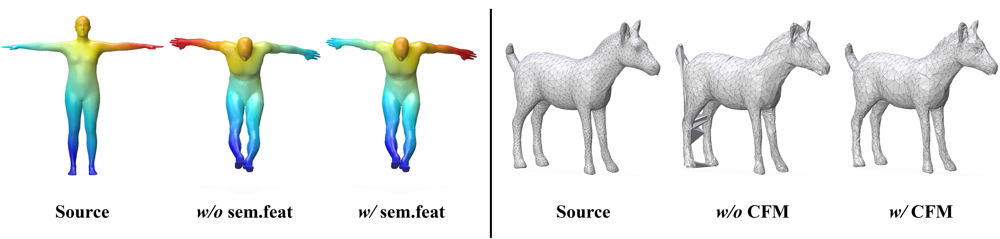

# SGMatch: Semantic-Guided Non-Rigid Shape Matching with Flow Regularization [ECCV 2026]

<a href="https://yetianwei.github.io/SGMatch/"></a>
<a href="https://yetianwei.github.io/assets/pdf/ye2026eccv.pdf"></a>
<a href="https://arxiv.org/abs/2603.12937"></a>



This repository contains the official implementation of **SGMatch: Semantic-Guided Non-Rigid Shape Matching with Flow Regularization**.

## Installation

We recommend creating a clean conda environment named `SGMatch` with Python 3.10.

```bash
conda create -n SGMatch python=3.10
conda activate SGMatch

# Install PyTorch
pip install torch==2.3.0 torchvision==0.18.0 --index-url https://download.pytorch.org/whl/cu121

# Install PyTorch3D
pip install "git+https://github.com/facebookresearch/pytorch3d.git@v0.7.8"

pip install -r requirements.txt
```

This code also uses Python bindings for an implementation of the Discrete Shell Energy. Please follow the installation instructions from [Thin shell energy](https://gitlab.com/numod/shell-energy).

## Dataset

For training and testing datasets used in this project, please refer to the [ULRSSM repository](https://github.com/dongliangcao/Unsupervised-Learning-of-Robust-Spectral-Shape-Matching/) and the corresponding original dataset providers. Place the datasets under `../data/`:

```text
data/
|-- FAUST_r/
|-- SCAPE_r/
|-- SHREC19_r/
|-- TOPKIDS/
|-- SMAL_r/
`-- DT4D_r/
```

## Data Preparation

For data preprocessing, we provide *[preprocess.py](preprocess.py)* to compute all things we need. Here is an example for SMAL_r.

```bash
python preprocess.py --data_root ../data/SMAL_r/ --no_normalize --n_eig 200
```

By default, preprocessing computes Laplacian operators, elastic operators, geodesic distance matrices, and DINOv2 semantic features. DINO features are saved under `dino/`, with intermediate cache files under `dino_cache/`.

For DT4D, use:

```bash
python preprocess_DT4D.py --data_root ../data/DT4D_r/ --no_normalize --n_eig 200
```

## Train

To train a specific model on a specified dataset.

```bash
python train.py --opt options/train/smal.yaml
```

You can visualize the training process in tensorboard or via wandb:

```bash
tensorboard --logdir experiments/
```

## Test

To test a specific model on a specified dataset.

```bash
python test.py --opt options/test/smal.yaml
```

The qualitative and quantitative results will be saved in the `results/` folder.

## Visualization

To visualize the final results:

```bash
python visualize.py --opt options/test/smal.yaml
```

The visualized images will be saved in the `results/` folder.

## Pretrained Models

Pretrained models will be released in the `checkpoints/` folder.

## Acknowledgement

The framework implementation is adapted from [Unsupervised Learning of Robust Spectral Shape Matching](https://github.com/dongliangcao/Unsupervised-Learning-of-Robust-Spectral-Shape-Matching/).

The implementation of Elastic Basis is adapted from [An Elastic Basis for Spectral Shape Correspondence](https://github.com/flrneha/ElasticBasisForSpectralMatching/).

The implementation of DiffusionNet is based on [the official implementation](https://github.com/nmwsharp/diffusion-net).

The implementation of DINO-based semantic feature extraction follows the ideas of [Diff3F](https://github.com/nv-tlabs/Diff3F) and uses [DINOv2](https://github.com/facebookresearch/dinov2).

We thank the original authors and dataset providers for their contributions to this code base and the shape analysis community.

## Citation

Please cite our paper when using the code:

```bibtex
@inproceedings{ye2026sgmatch,
  title     = {SGMatch: Semantic-Guided Non-Rigid Shape Matching with Flow Regularization},
  author    = {Ye, Tianwei and Mei, Xiaoguang and Xia, Yifan and Fan, Fan and Huang, Jun and Ma, Jiayi},
  booktitle = {European Conference on Computer Vision (ECCV)},
  year      = {2026}
}
```
